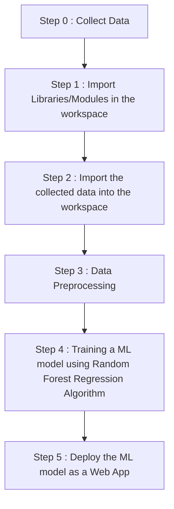

# Medical-Insurance-Cost-Predictor
This is a medical insurance cost predictor machine learning project using Random forest regressor

Link to the web app : 

<h1 align='center'> WORKFLOW OF PROJECT </h1>

